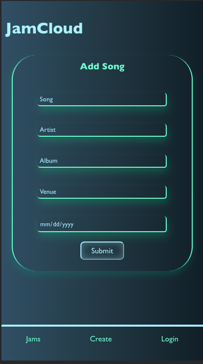
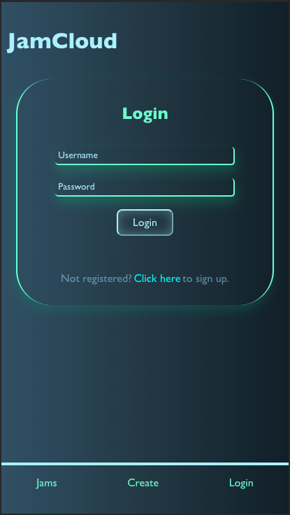
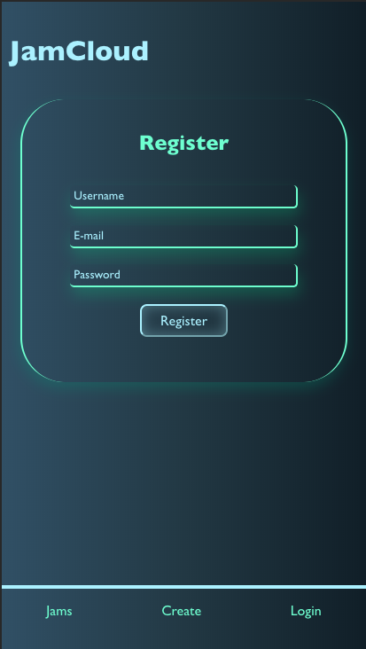
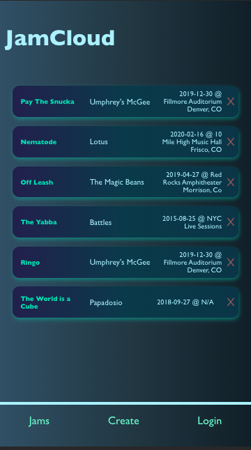

# Jamcloud-API
The jamcloud-api uses ExpressJS to connect the Jamcloud client with the Jamcloud PostgreSQL database allowing uses to create an account so that they can add to the growing list of jams. In the future the database will also store ratings, notes, and personalized lists linked to users.
## Tech Stack 

### Front End:

- React

### Back End: 

- NodeJS 
- ExpressJS
- PostgreSQL

## Screenshots 

- 
- 
- 
- 

##Links 

- Backend Repo: www.github.com/bilbertius/jc-s
- Frontend Repo: www.github.com/bilbertius/jamcloud-client
- Live app: www.jamcloud.now.sh